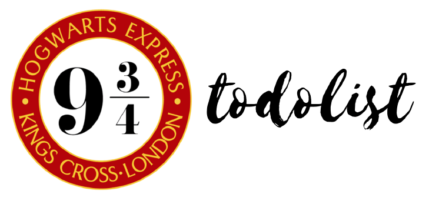
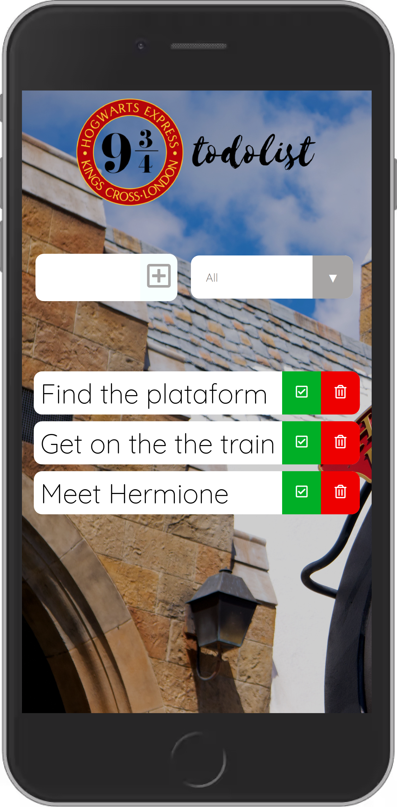
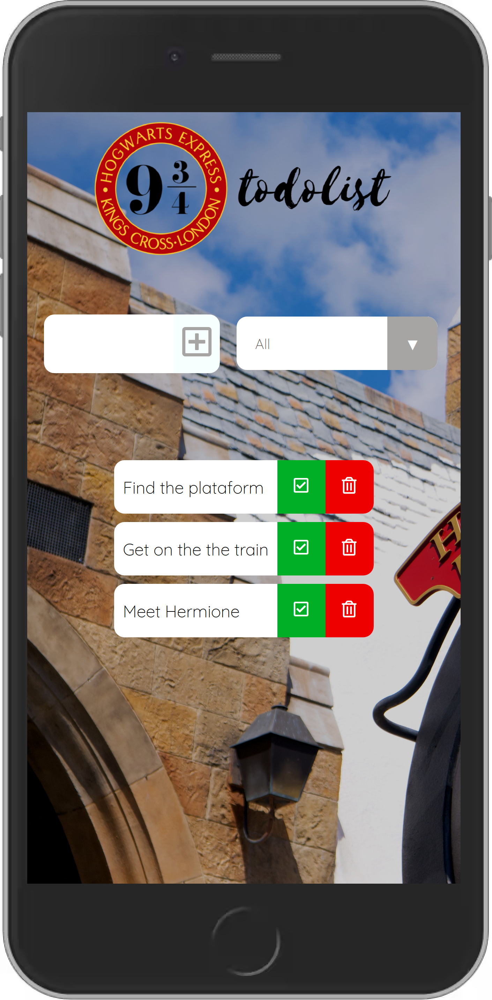

<h1 align="center">
    
</h1>

 

  

<<<<<<< HEAD
  
  
=======
  
  
>>>>>>> 94076ecbdd00b153682393fdbafc7e2b019282bd

 

## 🚀 Technologies

This project was developed using these technologies:

- Javascript
- CSS

## 💻 Project

9 3/4 todolist is a very simple application made with vanilla javascript. It is also a slight delight to Harry Potter fans!

## :memo: Licence

This project is under the MIT licence. Check the LICENCE file for detail.

Made with ♥ by WallysLS
