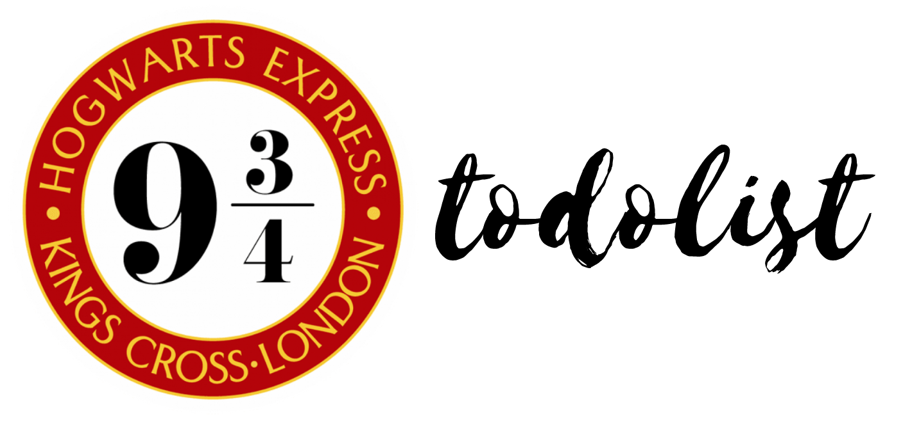

<h1 align="center">
    
</h1>

  <a href="#-tecnologias">Tecnologias</a>&nbsp;&nbsp;&nbsp;|&nbsp;&nbsp;&nbsp;
  <a href="#-projeto">Projeto</a>&nbsp;&nbsp;&nbsp;|&nbsp;&nbsp;&nbsp;
  <a href="#memo-licença">Licença</a>

 

  

 

  

## 🚀 Technologies

This project was developed using these technologies:

- [Javascript](https://nodejs.org/en/)
- [CSS](https://reactjs.org)
- [SASS](https://facebook.github.io/react-native/)

## 💻 Project

9 3/4 is a very simple todolist application made with vanilla javascript. It is also a slight delight to Harry Potter fans!

## :memo: Licence

This project is under the MIT licence. Check the [LICENSE](LICENSE.md) file for detail.

Made with ♥ by WallysLS
